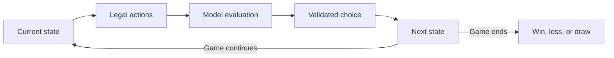

# Jev Playground

A playground for benchmarking **TypeSafe AI’s Jev against other evaluation models** in games with explicit states, legal actions, and measurable outcomes.

The core question: how well does each model choose the next action when the rules and available choices are clearly defined? Games provide a small, inspectable environment for exploring decision quality, tactical reasoning, and consistency across a sequence of moves.

## How it works

Each game acts as a state machine:



The game code owns the rules, legal actions, state transitions, and terminal conditions. The model chooses among the actions it is given. This keeps the decision visible: you can inspect the position, the available moves, and the choice that changed the game.

All opponents receive the same game state, legal options, and tactical instructions through Vercel AI Gateway. Jev uses a native evaluation model; Luna, Haiku, and Gemini use the SDK’s experimental evaluation adapter around Gateway language models. Astra uses `generateText` with `Output.object` and a Zod schema that restricts its `choice` to legal option names.

## Models

| Provider | Model | AI Gateway ID |
| --- | --- | --- |
| TypeSafe AI | Jev | `typesafe-ai/jev` |
| OpenAI | GPT-5.6 Luna | `openai/gpt-5.6-luna` |
| Anthropic | Claude Haiku 4.5 | `anthropic/claude-haiku-4.5` |
| Google | Gemini 3.5 Flash Lite | `google/gemini-3.5-flash-lite` |
| OpenAI | GPT-6 Astra | `openai/gpt-6-astra` |

The model list lives in [`src/lib/models.ts`](src/lib/models.ts). Model identifiers above are the Gateway IDs used by this app; direct provider SDKs may use different names.

## First game: tic-tac-toe

Play X against five opponents, each playing O on its own board. Games run independently, so you can play one model while another is thinking. Each board has its own move history, retry control, and restart button.

For each model turn, the server supplies the board and every legal move as a Choice option. Options have descriptive names such as `center` and `top_left`, coordinates, and the resulting board. Shared instructions describe the rules and priorities: win, block, create or prevent forks, and preserve a draw against optimal play.

Each decision log shows the chosen moves, board snapshots, option weights when returned, and provider confidence when available. Failed requests can be retried. Restarting a board cancels its pending request and clears its log without affecting the other games.

**Reading the results:** option weights describe the model’s returned Choice distribution; they are not win probabilities. Response confidence is a separate provider statistic and is not assumed to be comparable across models. Missing values are shown as unavailable, rather than inferred.

Astra’s structured response contains only the chosen square, such as `{"choice":"center"}`. Its option weights and confidence remain unavailable.

## Connect Four

Open [localhost:3000/connect-four](http://localhost:3000/connect-four) to play the same five models on independent 7-column, 6-row boards. Click any column to drop your terracotta disc (X); the model plays olive (O). Four in a row horizontally, vertically, or diagonally wins.

The server validates gravity, turn counts, and terminal states. Each legal column is a Choice option with its landing row and resulting board. Astra uses structured output restricted to those same column names. Decision logs highlight the chosen column and show every legal option’s weight and response confidence when supplied. Each board has its own retry and restart controls.

Rules live in `src/lib/connect-four.ts`, prompts in `src/lib/connect-four-ai.ts`, and the endpoint is `/api/connect-four/move`.

## Benchmark direction

The current app supports interactive comparisons in tic-tac-toe and Connect Four. Automated tournaments and aggregate scores are future work.

The benchmark should compare models on shared starting states and rules, tracking:

- **Decision quality:** wins, draws, losses, and missed winning or defensive moves.
- **Consistency:** how choices vary across repeated evaluations of the same state.
- **Reliability:** invalid responses, failed requests, and timeouts.
- **Efficiency:** latency and cost per decision and completed game.

Reproducible runs should record model versions, game states, instructions, and evaluation settings. Interactive play is useful for finding interesting positions; controlled runs are needed to make broader performance claims.

## Run locally

Built with Next.js, React, TypeScript, Bun, and the Vercel AI SDK.

```sh
bun install
```

Create `.env.local` with your Vercel AI Gateway key:

```dotenv
AI_GATEWAY_KEY=your_gateway_key
```

```sh
bun run dev
```

Open [localhost:3000/tic-tac-toe](http://localhost:3000/tic-tac-toe) and make your first move on any board. The root URL redirects to the game. The key is read only on the server, and environment files are ignored by Git.

## Project map

| File | Purpose |
| --- | --- |
| [`src/lib/game.ts`](src/lib/game.ts) | Board schemas, turn validation, and terminal conditions |
| [`src/lib/models.ts`](src/lib/models.ts) | Available opponents and model IDs |
| [`src/lib/ai-move.ts`](src/lib/ai-move.ts) | Shared evaluation instructions, legal choices, and response mapping |
| [`src/app/api/move/route.ts`](src/app/api/move/route.ts) | Request validation, model selection, and Gateway calls |
| [`src/app/tic-tac-toe/page.tsx`](src/app/tic-tac-toe/page.tsx) | Comparison page with a board for each model |
| [`src/app/tic-tac-toe/model-game.tsx`](src/app/tic-tac-toe/model-game.tsx) | Independent game state, requests, and turn flow |
| [`src/app/tic-tac-toe/decision-log.tsx`](src/app/tic-tac-toe/decision-log.tsx) | Move history, option weights, and confidence |

## Checks

```sh
bun run test
bun run lint
bun run build
```

Tests use mocked evaluations and do not make paid model calls. The evaluation API is experimental; `bun.lock` records the installed SDK versions.

## References

- [AI SDK evaluation API](https://ai-sdk.dev/docs/ai-sdk-core/evaluation)
- [TypeSafe Choice: structured instructions and criteria](https://docs.typesafe.ai/primitives/choice#structured-instructions-and-criteria)
